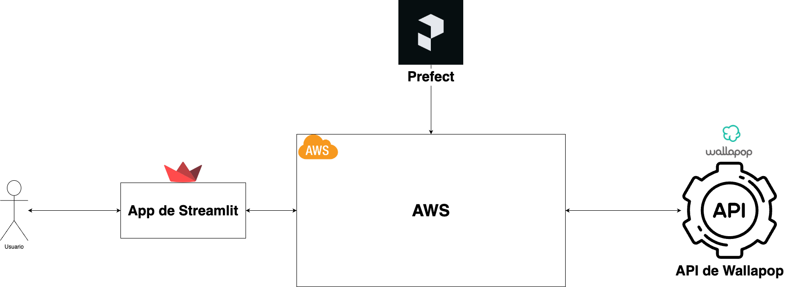
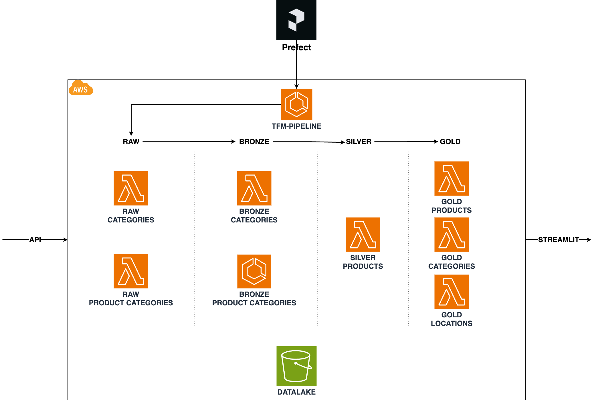
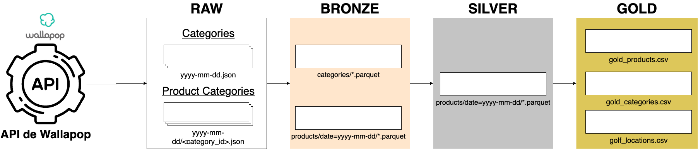

# Wallapop Data Extraction & Visualization Pipeline

This project is designed to extract, transform, and visualize data from Wallapop using a fully serverless architecture deployed on AWS. The project leverages tools like Prefect for ETL orchestration, Streamlit for data visualization, AWS for deployment, and Terraform for infrastructure as code.

---

## Architecture

### General Architecture

The general architecture of the project consists of several key components that work together to form a cohesive data processing pipeline:

1) **Wallapop API**: the source of the data. This API provides product information and other related data from Wallapop.
2) **AWS Services**: different services used to run the ETL.
3) **Prefect**: orchestrator tool used to coordinate the ETL every day.
4) **Streamlit**: visualization app with some final insights.

    

### AWS Services

In AWS, the project leverages several services to create a robust and scalable infrastructure:

1) Lambda Functions: Used for the extraction and transformation stages of the ETL pipeline. Each Lambda function performs a specific task, such as retrieving data from the Wallapop API or transforming the data.
2) ECS (Elastic Container Service) with Fargate: Handles more complex ETL tasks that exceed Lambda's resource limits. Fargate allows these tasks to run in a managed container environment without needing to provision or manage servers.
3) S3 (Simple Storage Service): Acts as the primary storage solution for the data lake. Raw data, as well as transformed data at various stages (bronze, silver, gold), is stored in S3 buckets.
4) Prefect Cloud: Orchestrates the ETL workflows. Prefect manages the scheduling and execution of ETL tasks and integrates with AWS to deploy and run tasks in a serverless environment.

    

### Data Flow

The data flow in this project follows a medallion architecture model, which includes several stages:

1) Raw Data & Bronze: Data is initially extracted from the Wallapop API and stored in its raw form in S3 buckets. This stage captures all available data with minimal transformation.
2) Bronze to Silver Transformation: Data is then processed to select relevant fields and store the results in a more structured format (e.g., Parquet) in S3. This stage involves preliminary cleaning and structuring of the data.
3) Silver to Gold Transformation: Further processing combines daily data and generates key performance indicators (KPIs). Data is aggregated and structured to produce final tables that are optimized for consumption by the Streamlit application.

    

---

## Project Structure

### /infrastructure

Contains the Terraform scripts used for deploying AWS infrastructure. This includes configurations for resources like Lambda functions, ECS tasks, S3 buckets, and more. The Terraform code allows for automated, repeatable infrastructure setup and management.

### /src/etl

Houses the ETL pipeline scripts written in Python. Each stage of the ETL process is encapsulated in Prefect tasks, orchestrated by a central flow. The ETL pipeline extracts data from the Wallapop API, processes it, and stores it in the AWS S3 bucket.

### /src/orchestration

Includes the Prefect flows and tasks definitions. This is where the orchestration logic is defined, ensuring that each ETL step is executed in the correct sequence with proper error handling and retries. The setup is designed to be scalable and serverless, using ECS and Fargate to execute the flows.

### /src/infra

Contains additional scripts and configurations required to support the ETL and deployment process. This includes Dockerfiles, requirements files, and other auxiliary scripts necessary for the smooth operation of the pipeline.


### /src/streamlit_app

This directory holds the Streamlit application code responsible for visualizing the processed data. The app includes views for products, categories, and locations (placeholder for future expansion). The application is deployed on Streamlit Cloud and can be accessed [here](https://cgarcia-cidaen-tfm.streamlit.app/).

---

## Infrastructure as Code (IaC)

To deploy the infrastructure on AWS, navigate to the /infrastructure directory and run the Terraform scripts. These scripts will automatically set up all necessary AWS resources, including Lambda functions, ECS clusters, S3 buckets, and more. This ensures that the entire environment can be recreated consistently and efficiently.

```bash
cd infrastructure
terraform init
terraform plan
terraform apply
```

---

## Github Actions

The CI/CD pipeline for this project is configured using GitHub Actions to automate deployments and updates. The pipeline consists of two main jobs:

1) **Terraform Deployment**

    - **Purpose**: Deploys and updates the AWS infrastructure using Terraform.
    - **Process**: This job runs Terraform commands to apply the infrastructure changes. It ensures that the necessary AWS resources are provisioned and configured correctly.
    - **Details**: The job checks out the repository code, sets up Terraform, and applies the configuration files found in the /infrastructure directory.

2) **Prefect Deployment**

    - **Purpose**: Deploys the Prefect ETL flow to Prefect Cloud.
    - **Process**: This job pushes the latest ETL flow definitions to Prefect Cloud, ensuring that the ETL pipeline is up-to-date and scheduled to run according to the defined parameters.
    - **Details**: The job checks out the repository code, sets up the environment, and uses the Prefect CLI to deploy the flow defined in the /src/orchestration directory.

---

## License

This project is licensed under the MIT License - see the LICENSE file for details.